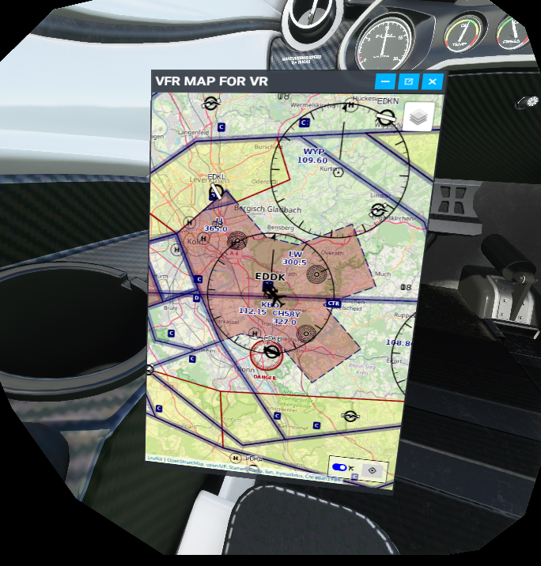
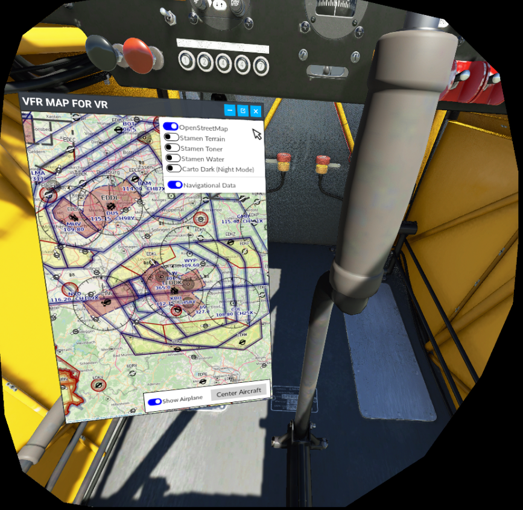

# MSFS: VFR-MAP FOR VFR FLYING

This project adds a helpful VFR map as an ingame panel, which is especially helpful for those who like to fly in VR (and thus not being able to look on a physical kneeboard, tablet or second screen).

I made this mod for myself and for now, it does exactly what I want. If you like it. Let me know and share it with other VR pilots :-)

# TL;DR

The Mod consists of **TWO PARTS(!)**: a *server* and an *ingame-panel* that you need to install and run **BOTH**!

**Please take the time to at least read the Installation and Usage sections below!!!**

It's dead simple! But if you only install the panel to the community folder and ignore the server this mod won't run and may appear "broken" to you!

# Features

- The VFR-Map is a separate panel inside the sim: No fiddling around with virtual desktop browser windows etc.
- Map resolution etc. is optimized for VR use. Fair warning: On desktop browsers the map may look quite low res and UI elements may appear too big (for adjustments see "Advanced Usage" below).
- Hide your own airplane on the map for a fully fledged "paper map on kneeboard"-VFR-navigation feeling
- Toggle to show and automatically follow your airplane on the map for a more "GPS"-ish style of navigation
- Five different map types
- Navigation data overlay

# Components

The mod projects consists of two components:

## Server

`vfrmap-server` is the webserver that connects to your flight simulator and communicates with it to receive location data etc.

## Client

`msfs-panel` is the actual ingame panel.

# Installation

Download the zip from [here](https://github.com/Christian1984/vfrmap-for-vr/releases)

## Server

Place the contents of `vfrmap-server` file somewhere convenient (like C:\Tools\vfrmap\).

## Client

Place the folder `christian1984-ingamepanel-vfrmapforvr` in your MSFS community folder (typically `C:\Users\[username]\AppData\Local\Packages\Microsoft.FlightSimulator_8wekyb3d8bbwe\LocalCache\Packages\Community`)

# Usage

- Start MSFS FIRST(!)
- Start `vfrmap-for-vr.exe` AFTERWARDS(!), not before MSFS has entered the main menu
- Open up the ingame panel once inside the sim (like you would do for ATC etc.)
- Place conveniently in your VR space
- Click "Center Airplane" to initially center the map on your airplane.

## Advanced Configuration

If the text on the map is too large or too small for you to read, copy `vfrmap/index.html` (from the repository) to the same directory as `vfrmap-for-vr.exe` and scroll to line 161. Set on of the following values:

- `let map_resolution = map_resolutions.low;`: Large text on map, low resolution
- `let map_resolution = map_resolutions.medium;`: Medium sized text on map, medium resolution (recommended for VR usage)
- `let map_resolution = map_resolutions.high;`: Small text on map, but high resolution (recommended for non-VR usage)

If the UI elements are too large for you, head over to `vrmap-server/index.html` and look at lines 41, 46 and 59.

- For large UI elements, activate the lines with `transform: scale(3) [...]`, and deactivate lines with `transform: scale(2) [...]` (recommended for VR usage)
- For medium UI elements, activate the lines with `transform: scale(2) [...]`, and deactivate lines with `transform: scale(3) [...]`
- For small UI elements, deactivate in the lines with `transform: scale(2) [...]` as well as the lines with `transform: scale(3) [...]` (recommended for non-VR usage)

## Troubleshooting

- "I get errors when I try to start the server!" => This can happen if, for whatever reason, `vfrmap-for-vr.exe` cannot write `simconnect.dll`. Use your windows search to search for simconnect.dll (or download a copy somewhere on the interwebs) and copy it to the same directory `vfrmap-for-vr.exe` is located!

# Known Issues

- Remove the need for the "Advanced Configuration"-Section above by adding the possibility to change the UI scale at runtime through the UI itself. That feature didn't make it to this first version, though :-)
- Sometimes the panel doesn't properly load when clicking "restart" after a crash.

## Feature Wishlist:

- Draw course on map (Stage 1: manually, Stage 2: pull from flight plan)

### TODO: Check if feasible?

- Is it possible to add navigation data from Navigraph?
- Is it possible to add frequencies (such as VOR/DME/Comm)?
- Is it possible to change airport elevation data from [m] to [ft]?

## Fixed / Added

- Clicking "Center Airplane" to initially center the map on the airplane is no longer necessary.
- `build-vfrmap.sh` replaced with working `build-vfrmap-server.bat`
- Input elements for teleport fixed
- Separate index.html no longer required

# Screenshots

# Attribution

This project uses forks of two amazing community projects. Without them it would have taken me an incredible amount of time building this thing. Hence, I want to thank the two:

- The server is forked from [lian/msfs2020-go](https://github.com/lian/msfs2020-go).
- The client/ingame panel is forked from [bymaximus/msfs2020-toolbar-window-template](https://github.com/bymaximus/msfs2020-toolbar-window-template).

Great work, guys! Thanks for sharing your work with us!!!

Icon made by [Freepik](https://www.freepik.com) from [www.flaticon.com](https://www.flaticon.com/).

# Releases and Download

Program zips releases are uploaded [here](https://github.com/Christian1984/vfrmap-for-vr/releases).

# How to contribute?

If you have suggestions or issues, please feel free to reach out to me or create an issue within the github repository. You may also add stuff yourself. Pull requests are very welcome!

# Why does my virus-scanning software think this program is infected?

From official golang website https://golang.org/doc/faq#virus

"This is a common occurrence, especially on Windows machines, and is almost always a false positive. Commercial virus scanning programs are often confused by the structure of Go binaries, which they don't see as often as those compiled from other languages."

# Support your modders :-)

If you enjoy this project, please consider buying me a coffee and/or donating to the guys I mentioned in the Attribution section above. It allows us to keep developing addons and mods like this ones and making them available for free. Any amount is welcome! Thank you.

