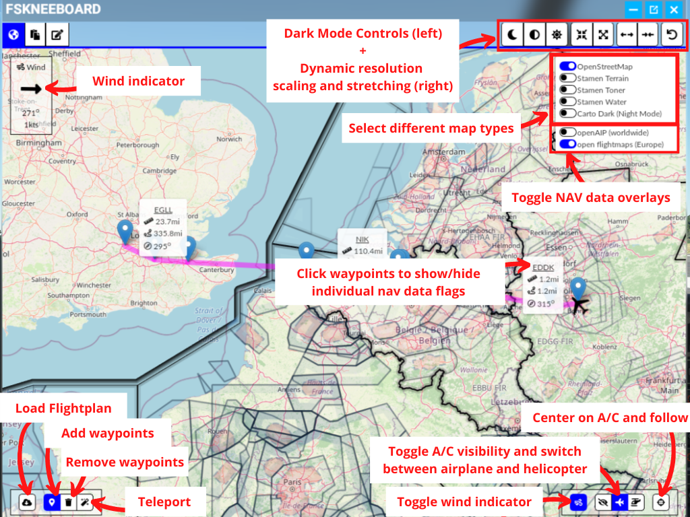

# FSKneeboard: A powerful VR-Cockpit Manager for Microsoft Flight Simulator

This project (formerly known as VFR Map For VR) adds a helpful ingame panel to your flight simulator which brings

- Several different Maps, Waypoint\* and Tracks\*,
- a Charts Viewer\* and
- a Notepad\*

right into your cockpit! This is is especially helpful for those of us who like to fly in VR (and thus not being able to look on a physical kneeboard, tablet, or second screen).

Additionally, FSKneeboard adds a very helpful fully automated and configurable Autosave Feature\*.

I made this mod for myself and for now, it does exactly what I want. And since the latest release, it does even more stuff that you guys, the community, asked for!

If you like it, please let me know and share it with other VR pilots :-)

*(\*) indicates "premium"-features that are available in FSKneeboard PRO, which is available for a Pay-What-You-Want-Price at https://fskneeboard.com/buy-now*

---

# Table of Contents

1. [Screenshots](#screenshots)
2. [TL;DR](#tldr)
3. [Support Your Modders :-)](#support-your-modders-smiley)
4. [Go PRO](#go-pro)
5. [Features](#features)
6. [Components](#components)
7. [Installation](#installation)
8. [Usage](#usage)
9. [Advanced Configuration](#advanced-configuration)
10. [Troubleshooting](#troubleshooting)
11. [Roadmap](#roadmap)
12. [Attribution](#attribution)
13. [Releases and Downloads](#releases-and-downloads)
14. [How to Contribute?](#how-to-contribute)
15. [HELP!!! Why Does My Virus-Scanning Software Think This Program Is Infected?](#help-why-does-my-virus-scanning-software-think-this-program-is-infected)

---

# Screenshots

# TL;DR

The Mod consists of **TWO PARTS(!)**: a *server* and an *ingame-panel* that you need to install and run **BOTH**!

**Please take the time to at least read the Installation and Usage sections below!!!**

It's dead simple! But if you only install the panel to the community folder and ignore the server this mod won't run and may appear "broken" to you!

**Some malware- and virus scanners detect FSKneeboard.exe as a virus! This is a false positive and known issue. Please read below ["HELP!!! Why Does My Virus-Scanning Software Think This Program Is Infected?"](#help-why-does-my-virus-scanning-software-think-this-program-is-infected) to learn more!**

---

# Support Your Modders :-)

If you enjoy this project, please consider buying me a coffee and/or donating to the guys I mentioned in the Attribution section. It allows us to keep developing addons and mods like these ones and making them available for free. Any amount is welcome! Thank you.

## Go PRO

Alternatively, you may decide to "go pro" at a Pay-What-You-Want-Price! It's really your call! You'll unlock all features of FSKneeboard plus you support the mod development. Also, you'll make a 1-year-old and a 5-year-old very, very happy, as I can buy them more ice cream :-)

---

# Features

- The VFR-Map is a separate panel inside the sim: No fiddling around with virtual desktop browser windows etc.
- Map resolution etc. is optimized for VR use.
- Hide your own airplane on the map for a fully-fledged "paper map on kneeboard"-VFR navigation feeling
- Toggle to show and automatically follow your airplane on the map for a more "GPS"-ish style of navigation
- Five different map types
- Navigation data overlay
- Add, remove and modify waypoints and tracks on the map\*
- Watch charts and checklists inside the integrated charts viewer\*
- Take notes inflight with your mouse on the integrated notepad\*

*(\*) indicates "premium"-features that are available in FSKneeboard PRO, which is available for a Pay-What-You-Want-Price at https://fskneeboard.com/buy-now*

---

# Components

The mod project consists of two components:

## Server

`fskneeboard-server` is the webserver that connects to your flight simulator and communicates with it to receive location data etc.

## Client

`fskneeboard-panel` is the actual ingame panel.

---

# Installation

Download the zip from [here](https://github.com/Christian1984/vfrmap-for-vr/releases)

## Server

Place the contents of `fskneeboard-server` file somewhere convenient (like `C:\Tools\fskneeboard\`).

Afterward, your `fskneeboard-server` folder should look like this:

If you have purchased FSKneeboard PRO make sure to also place your fskneeboard.lic-License file here! Your finished PRO-installation should look like this:

## Client

Place the folder `christian1984-ingamepanel-fskneeboard` in your MSFS community folder (typically `C:\Users\[username]\AppData\Local\Packages\Microsoft.FlightSimulator_8wekyb3d8bbwe\LocalCache\Packages\Community`)

When finished, your Community folder should look like this (though there may be more than one extension installed, obviously).

## Upgrading to a New Version

Please remove **all files** from the server directory and `christian1984-ingamepanel-fskneeboard` from your community folder, before installing a new version. Do not "copy over". No excuses! Old files may interfere with new ones and break the mod. Just do it, but keep your license file :-)

---

# Usage

- Depending on where you have purchased Microsoft Flight Simulator, you may use launch FSKneeboard's starting:
    - `fskneeboard-autostart-windows-store.bat` for owners who have purchased via Windows Store (which simply calls `fskneeboard.exe --winstorefs`), or
    - `fskneeboard-autostart-steam.bat` for owners who have purchased via Steam (which simply calls `fskneeboard.exe --steamfs`)

- If you encounter any errors or unexpected behaviour, simply run `fskneeboard.exe`. This has the autostart feature disabled by default. FSKneeboard will now wait until you have started Flight Simulator **manually**!
- Open up the ingame panel once inside the sim (like you would do for ATC etc.)
- Place conveniently in your VR space
- Click "Center Airplane" to initially center the map on your airplane.

## Map Viewer

The map is the core component of FSKneeboard and available to FREE and PRO users alike. It contains several map modes as well as a representation of your own aircraft that you may also turn off so that you can "navigate by hand" on bush trips and the likes.

Owners of FSKneeboard PRO can also access the waypoint feature, which allows you to manually place waypoints on the map. A track will be automatically added between waypoints and flags will show you information about the distance to that waypoint and the heading.

## Charts Viewer

FSKneeboard PRO contains a fully-fledged charts viewer for charts in png format. You can navigate the charts by either using the toolbar on the top or by dragging to pan the map around. You can also use your mouse wheel to zoom. 

Make sure to place your charts inside the `charts` folder inside the server directory.

Your charts folder should look like this:

## Notepad

Notepad is another feature that FSKneeboard PRO users have access to. It allows you to take notes during your flight session by simply drawing on it with your mouse.

## Autosave

Autosave is a feature that allows you to automatically create "snapshots" of your flights on predefined intervals. This is especially useful if you happen to encounter occasional (or even frequent) crashes to desktop (CTDs) with Microsoft Flight Simulator in VR.

Simply run FSKneeboard with the flag `--autosave <int>` to create a snapshot every `<int>` minutes. For example, run `fskneeboard.exe --autosave 10` to crate one savegame every 10 minutes.

FSKneeboard automatically deletes older snapshots and keep only the latest 5.

If you need to restore a flight, you can find your autosaves inside your FSKneeboard-Server folder in the subdirectory `autosave`, e.g. `C:\Tools\fskneeboard\autosave`.

---

# Advanced Configuration

If the text on the map is too large or too small for you to read, copy `vfrmap/html/index.html` (from the github repository) to [your server-directory]\vfrmap\html and scroll to line 266. Set one of the following values:

- `let map_resolution = map_resolutions.low;`: Large text on map, low resolution
- `let map_resolution = map_resolutions.medium;`: Medium sized text on map, medium resolution (recommended for VR usage)
- `let map_resolution = map_resolutions.high;`: Small text on map, but high resolution (recommended for non-VR usage)

---

# Troubleshooting

- "I get errors when I try to start the server!" => This can happen if, for whatever reason, `fskneeboard.exe` cannot write `simconnect.dll`. Use your windows search to search for simconnect.dll (or download a copy somewhere on the interwebs) and copy it to the same directory `fskneeboard.exe` is located!
- "MSFS crashes when I use your mod!" => I've noticed that this can happen when you have multiple extensions running that each add an additional panel/"window" to your flight simulator environment. In that case, you will probably have to pick one mod and remove the other. Sorry! I haven't found a way around that limitation, yet.
- "Windows says FSKneeboard contains a virus!" => That is a false positive and a well-known problem with software written in GO. Please make sure to read the section [HELP!!! Why Does My Virus-Scanning Software Think This Program Is Infected?](#help-why-does-my-virus-scanning-software-think-this-program-is-infected) below.
- "I've placed my pdf-charts in the charts directory but I can't see them inside the sim!" => Due to the limited capabilities of the browser engine that is embedded in Flight Simulator, the charts viewer can only display charts in png format. You will have to convert your charts. There is a multitude of pdf-to-png converters available online for free. Alternatively, you may want to take a look at GIMP, which is a freeware that also enables you to convert pdf files to png locally. If you know about other options, please reach out and let me know so that I can add them to this readme file.

---

# Roadmap

Here's a list of features that I've planned to implement in the foreseeable future: 

- Migrate the entire server component from GO to .NET to mitigate false virus alerts
- Automatically generate waypoints from Flight Simulator's flight plan
- Take notes via iPads and then have them synced to your in-sim notepad
- Allow for multiple notes to be taken, instead of having only one "sheet"
- Dynamic "in-sim" resolution controls for the map component to mitigate issues with different headsets and allow for better accessibility
- Embed Twitch Chat / Discord / YouTube(?)
- (... This could be your wish :-) ...)

And here are some wishes from the community that I have to check for feasibility as soon as I get to it:

- Is it possible to add navigation data from Navigraph?
- Is it possible to add frequencies (such as VOR/DME/Comm)?
- Is it possible to change airport elevation data from [m] to [ft]?

---

# Attribution

This project uses forks of two amazing community projects. Without them, it would have taken me an incredible amount of time building this thing all on my own. Hence, I want to thank the two:

- The server is forked from [lian/msfs2020-go](https://github.com/lian/msfs2020-go).
- The client/ingame panel is forked from [bymaximus/msfs2020-toolbar-window-template](https://github.com/bymaximus/msfs2020-toolbar-window-template).

Great work, guys! Thanks for sharing your work with us!!!

Icon made by [Freepik](https://www.freepik.com) from [www.flaticon.com](https://www.flaticon.com/).

Icons provided by [FontAwesome](https://fontawesome.com/license/free).

---

# Releases and Downloads

Program zips of FSKneeboard FREE are released and uploaded [here](https://github.com/Christian1984/vfrmap-for-vr/releases).

If you decide to support the development of this mod by buying a copy of FSKneeboard PRO [here](https://fskneeboard.com/buy-now) you will be emailed a link where you can download the FSKneeboard PRO binaries.

---

# How to Contribute?

If you have suggestions or issues, please feel free to reach out to me or create an issue within the Github repository. You may also add stuff yourself. Pull requests are very welcome!

---

# HELP!!! Why Does My Virus-Scanning Software Think This Program Is Infected?

From official golang website https://golang.org/doc/faq#virus

"This is a common occurrence, especially on Windows machines, and is almost always a false positive. Commercial virus scanning programs are often confused by the structure of Go binaries, which they don't see as often as those compiled from other languages."

Personal statement:

> If you don't trust the binary my suggestion would be two-fold:
>
> - Step 1: Upload the binaries to virustotal and see how many scanners throw a positive.
> - Step 2: Clone the repository and build the binary yourself. Everything is open-source, hence anyone who knows anything about building software can check the codebase for harmful code...
>
> Generally speaking (and that's true for anything you download from the web): If you don't trust the code, don't execute it! Especially NOT with elevated rights(!!!) I can understand anyone who doesn't want to run the software and appreciate how people ask questions instead of simply running the server...
>
> At the end of the day, it is your call. If you don't trust me and a binary that is flagged by a virus scanner, I do respect that. It's common sense, and I am not happy with the entire false-positive situation either. That is why in the mid-term I am planning to migrate the entire server component from GO to .NET, which should hopefully help to mitigate the issue.

However, here's a virus report from virustotal for the binaries of Version 1.0.3. Please note how many virus scanners do NOT flag the server as a positive. Please upload your own copy of FSKneeboard to virustotal to see the results of the latest version for yourself.

---

# Support Your Modders :-)

If you enjoy this project, please consider buying me a coffee and/or donating to the guys I mentioned in the Attribution section above. It allows us to keep developing addons and mods like these ones and making them available for free. Any amount is welcome! Thank you.

