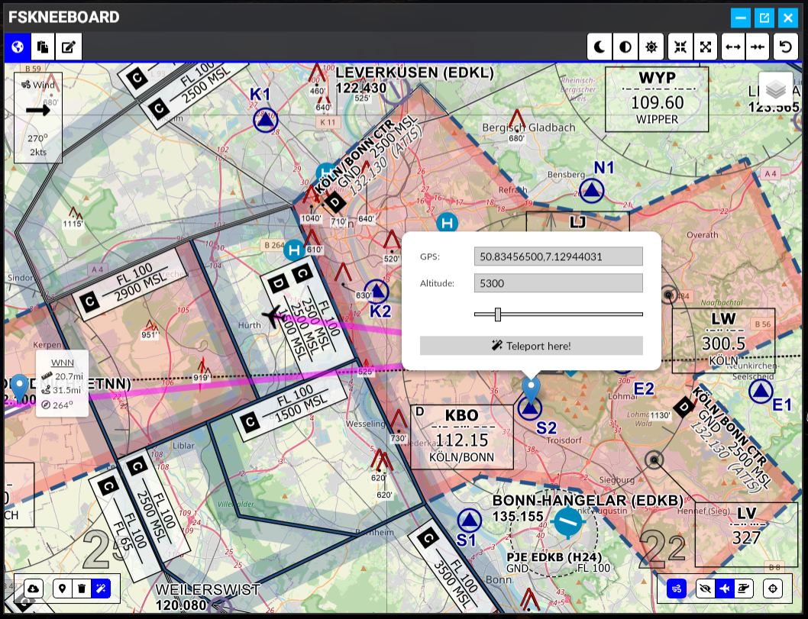
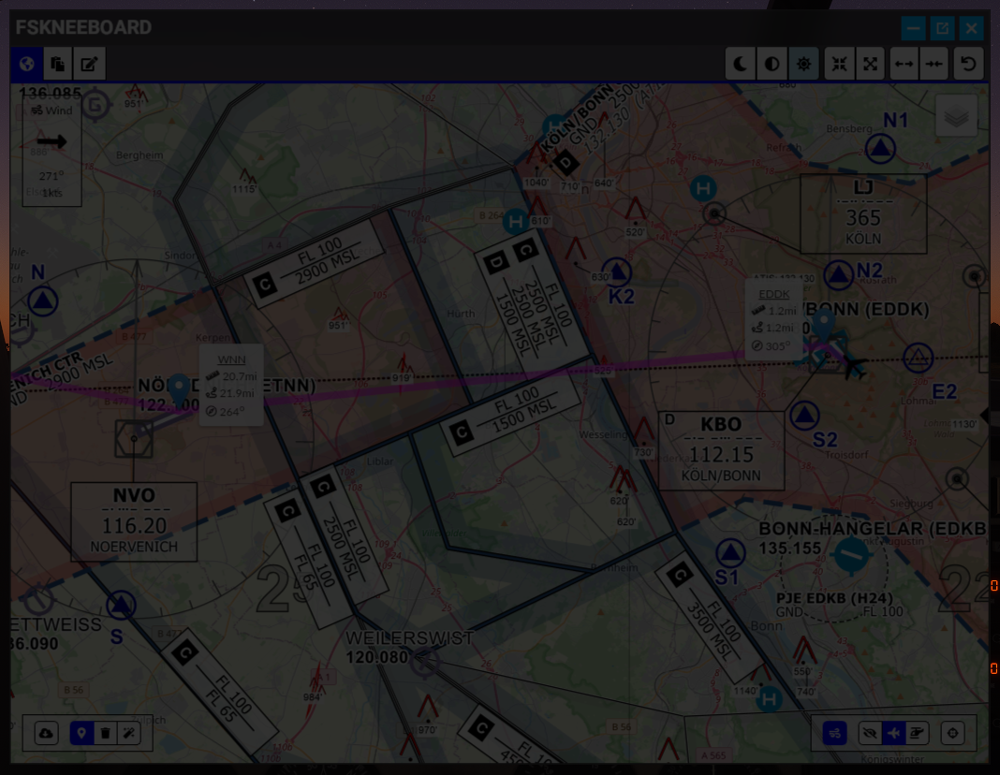
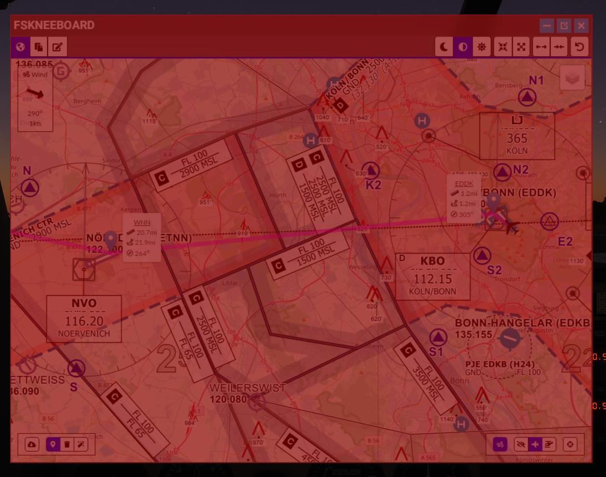
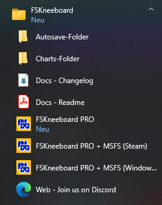

# FSKneeboard: A powerful VR-Cockpit Manager for Microsoft Flight Simulator

This project (formerly known as VFR Map For VR) adds a helpful ingame panel to your flight simulator which brings

-   Several different Maps, Waypoint<sup>\*</sup> and Tracks<sup>\*</sup>,
-   a Charts Viewer<sup>\*</sup> and
-   a Notepad<sup>\*</sup>

right into your cockpit! This is is especially helpful for those of us who like to fly in VR (and thus not being able to look on a physical kneeboard, tablet, or second screen).

Additionally, FSKneeboard adds a very helpful fully automated and configurable Autosave Feature<sup>\*</sup>.

I made this mod for myself and for now, it does exactly what I want. And since the latest release, it does even more stuff that you guys, the community, asked for!

If you like it, please let me know and share it with other VR pilots :-) Also, consider yourself invited to join me and the community on the [FSKneeboard Discord Server](https://discord.fskneeboard.com) at https://discord.fskneeboard.com

(\*) indicates "premium"-features that are available in FSKneeboard PRO, which is available for a Pay-What-You-Want-Price at https://fskneeboard.com/buy-now

---

# Table of Contents

1. [Screenshots](#screenshots)
2. [TL;DR](#tldr)
3. [Support Your Modders :-)](#support-your-modders-smiley)
4. [Go PRO](#go-pro)
5. [Getting Support](#getting-support)
6. [Features](#features)
7. [Components](#components)
8. [Installation](#installation)
9. [First Launch](#first-launch)
10. [Usage](#usage)
11. [Advanced Usage](#advanced-usage)
12. [Troubleshooting](#troubleshooting)
13. [Attribution](#attribution)
14. [Releases and Downloads](#releases-and-downloads)
15. [How to Contribute?](#how-to-contribute)
16. [HELP!!! Why Does My Virus-Scanning Software Think This Program Is Infected?](#help-why-does-my-virus-scanning-software-think-this-program-is-infected)

---

<div style="page-break-after: always;"></div>

# Screenshots


_Toolbar Icon_


_Navigational Data Enabled_


_Charts Viewer_


_Notepad_



_Teleport UI_



_Dark Mode_



_Dark Mode (Red Flashlight)_


_Waypoints with ICAO Identifiers (Old UI)_

# TL;DR

The Mod consists of **TWO PARTS(!)**: a **server** and an **ingame-panel** that you need to install and run **BOTH**!

**Please take the time to at least read the Installation and Usage sections below!!!**

It's dead simple! But if you only install the panel to the community folder and ignore the server this mod won't run and may appear "broken" to you!

**Some malware- and virus scanners detect FSKneeboard.exe as a virus! This is a false positive and known issue. Please read below ["HELP!!! Why Does My Virus-Scanning Software Think This Program Is Infected?"](#help-why-does-my-virus-scanning-software-think-this-program-is-infected) to learn more!**

# Support Your Modders :-)

If you enjoy this project, please consider buying me a coffee and/or donating to the guys I mentioned in the Attribution section. It allows us to keep developing addons and mods like these ones and making them available for free. Any amount is welcome! Thank you.

[](https://www.paypal.com/donate?hosted_button_id=ED8RR2JTV9BGU)

If you want to go above and beyond, you're invited to kindly check out my [Patreon](https://patreon.com/chrisvomrhein), which is another highly welcome way to show your support of and love for the project. You can find it here: [https://patreon.com/chrisvomrhein](https://patreon.com/chrisvomrhein)

# Go PRO

Alternatively, you may decide to "go pro" at a Pay-What-You-Want-Price! It's really your call! You'll unlock all features of FSKneeboard plus you support the mod development. Also, you'll make a 1-year-old and a 5-year-old very, very happy, as I can buy them more ice cream :-)

# Getting Support

If you have any problems, questions or would like to get in touch and stay involved with an active community of like-minded VR enthusiasts, then don't miss out on yoining our community Discord over at [https://discord.fskneeboard.com](https://discord.fskneeboard.com)!

---

<div style="page-break-after: always;"></div>

# Features

-   The VFR-Map is a separate panel inside the sim: No fiddling around with virtual desktop browser windows etc.
-   Map resolution etc. is optimized for VR use, and fully customizable while ingame
-   Hide your own airplane on the map for a fully-fledged "paper map on kneeboard"-VFR navigation feeling
-   Toggle to show and automatically follow your airplane on the map for a more "GPS"-ish style of navigation
-   Five different map types
-   Several different navigation data overlays, including open flightmaps and openAIP
-   Dark Mode (adjustable brightness + "red flashlight mode")
-   Configurable hotkey to show/hide the FSKneeboard panel while ingame
-   Windows Installer for simple installation and configuration
-   Add, remove and modify waypoints and tracks on the map<sup>\*</sup>
-   Pull the currently loaded flightplan from MSFS into your kneeboard map, including ICAO identifiers<sup>\*</sup>
-   Search for any address or POI worldwide right from FSKneeboard and add it as waypoint or even teleport there<sup>\*</sup>
-   Watch charts and checklists inside the integrated charts viewer<sup>\*</sup>
-   Organize approach charts, checklists, weather charts etc. in separate subfolders<sup>\*</sup>
-   Take notes inflight with your mouse on the integrated notepad<sup>\*</sup>
-   Automatically create snapshots/savegames from your flights every few minutes so you're able to recover Flight Simulator instabilities and crashes (fully configurable, see [Advanced Usage Section](#advanced-usage) for details)<sup>\*</sup>

_(\*) indicates "premium"-features that are available in FSKneeboard PRO, which is available for a Pay-What-You-Want-Price at https://fskneeboard.com/buy-now_

## FREE vs. PRO

Here's a quick feature breakdown of what features are included in both the FREE and the PRO version, and which features are exclusive for PRO version supporters...

<table id="free-pro-compare">
<tbody>
<tr>
<th></th>
<th>Free</th>
<th>PRO</th>
</tr>
<tr>
<td>Highly detailed maps for VFR flying</td>
<td>✅
Yes</td>
<td>✅
Yes</td>
</tr>
<tr>
<td>Map resolution and UI optimized for VR (and FULLY configurable)</td>
<td>✅
Yes</td>
<td>✅
Yes</td>
</tr>
<tr>
<td>"Moving Map" (i.e. map follows your airplane position in real time)</td>
<td>✅
Yes</td>
<td>✅
Yes</td>
</tr>
<tr>
<td>Optional trail, showing your recent flight path on the map</td>
<td>✅
Yes</td>
<td>✅
Yes</td>
</tr>
<tr>
<td>Hide airplane for full "paper map navigation" experience</td>
<td>✅
Yes</td>
<td>✅
Yes</td>
</tr>
<tr>
<td>Teleport to any position on the planet with a click of a button</td>
<td>✅
Yes</td>
<td>✅
Yes</td>
</tr>
<tr>
<td>Night mode (Maps)</td>
<td>✅
Yes</td>
<td>✅
Yes</td>
</tr>
<tr>
<td>Configurable Hotkey</td>
<td>✅
Yes</td>
<td>✅
Yes</td>
</tr>
<tr>
<td>Additional Map Layers with custom API keys (e.g. Bing Maps)</td>
<td>❌
No</td>
<td>✅
Yes</td>
</tr>
<tr>
<td>Waypoints</td>
<td>❌
No</td>
<td>✅
Yes</td>
</tr>
<tr>
<td>Navigation Tools (measure arbitrary distances and angles)</td>
<td>❌
No</td>
<td>✅
Yes</td>
</tr>
<tr>
<td>Load Flight Simulator Flightplan</td>
<td>❌
No</td>
<td>✅
Yes</td>
</tr>
<tr>
<td>Locate ANY address or POI around the world and add it as a waypoint to your flightplan</td>
<td>❌
No</td>
<td>✅
Yes</td>
</tr>
<tr>
<td>Track data (like total distance, per-waypoint-distance and course to next waypoint etc.)</td>
<td>❌
No</td>
<td>✅
Yes</td>
</tr>
<tr>
<td>Charts Viewer for approach charts, checklists, notes etc.</td>
<td>❌
No</td>
<td>✅
Yes</td>
</tr>
<tr>
<td>Notepad for taking notes in-VR without peeking under your headset</td>
<td>❌
No</td>
<td>✅
Yes</td>
</tr>
<tr>
<td>Notetaking with your physical iPad or Android tablet and instant sync into your VR cockpit</td>
<td>❌
No</td>
<td>✅
Yes</td>
</tr>
<tr>
<td>Configurable Autosave function to recover your flights, for example after a system crash</td>
<td>❌
No</td>
<td>✅
Yes</td>
</tr>
<tr>
<td>YOU actively support the ongoing development of FSKneeboard, bringing Flight Simming in VR to the next level :-)</td>
<td>😎
Sure! Thanks for giving the mod a shot :-) Spread the word!</td>
<td>💚
YEAH! You rock!!!</td>
</tr>
<tr>
<td></td>
<td><a class="more-link" href="https://github.com/Christian1984/vfrmap-for-vr/releases" target="_blank" rel="noopener">TRY FREE</a></td>
<td><a class="more-link" href="https://fskneeboard.com/buy-now/">BUY NOW</a></td>
</tr>
</tbody>
</table>

---

<div style="page-break-after: always;"></div>

# Components

The mod project consists of two components:

## Server

`fskneeboard-server` is the webserver that connects to your flight simulator and communicates with it to receive location data etc.

## Client

`fskneeboard-panel` is the actual ingame panel.

---

# Installation

There are two ways to install FSKneeboard on your system: With a fully automated installer (recommended) or doing everything manually...

## Windows Installer (Recommended)

Download the Installer-Executable (`Install-FSKneeboard-FREE-vX.Z.Y.exe`) from [the release section](https://github.com/Christian1984/vfrmap-for-vr/releases).

> Please Note: PRO users will receive a separate download link upon purchasing their license to download the PRO-Version Installer!

### Step 1: Launch the Installer

Once the download is finished, run the installer from the download directory. Administrator privileges are NOT required!!!

<div style="page-break-after: always;"></div>

### Step 2: Pick a Server Directory

Select a directory where you want to install the FSKneeboard server. The suggested default location is in `%LOCALAPPDATA%\Programs\FSKneeboard`, but you can change it to whatever you deem fit (like `C:\Tools\fskneeboard\` for example). Click `Next`!


_Select a Server Directory_

<div style="page-break-after: always;"></div>

### Step 3: Select your MSFS Community Folder

Next, the FSKneeboard Installer tries to locate your MSFS Community Folder, where the ingame panel must be installed to. The automatic location mechanism "should work" (TM) for both the Windows Store as well as the Steam versions of the game and the installer will tell you if it did succeed. Otherwise you will have to locate your Community Folder by hand. Then click `Next`!

IMPORTANT: Just pick the community folder! Do not add any subfolders. Otherwise the panel will NOT work!


_Locate your MSFS Community Folder_

<div style="page-break-after: always;"></div>

### Step 4: PRO-Users only!!! Download your license and tell the Installer where to find it

At that stage, PRO supporters should have their license ready (usually somewhere in your Downloads folder). Click Browse and select it. Then click `Next`!


_Locate your FSKneeboard PRO license file_

> Please note:
>
> This step will be skipped if there is already a license file present in the intended installation directory (when updating, for example).

<div style="page-break-after: always;"></div>

### Step 5: Proceed

You should now see a summary of what the installer will copy to what folders. Click `Next` and the installation will begin. At the end, you will find everything you need to start FSKneeboard in your windows start menu.



_FSKneeboard Start Menu Items_

### Upgrading to a New Version

When upgrading to a new version, you should unistall the old one. You are free to try to simply "update" what you already have, but I don't recommend it. Old files may interfere with new ones and break the mod. Therefore, in case you encounter bugs after upgrading, properly uninstall FSKneeboard and go for a fresh install!

Make sure to backup your license file and your charts folder, though, just to be save :-)

<div style="page-break-after: always;"></div>

## Manual Installation (For those who don't trust the installer or need a "portable" version...)

Download the zip from [here](https://github.com/Christian1984/vfrmap-for-vr/releases).

> Please Note: PRO users will receive a separate download link upon purchasing their license to download the PRO-Version!

### Manually Installing the Server Component

Place the contents of `fskneeboard-server` file somewhere convenient (like `C:\Tools\fskneeboard\`).


_Server Installation_

Afterward, your `fskneeboard-server` folder should look like this:


_Server Installation - Done_

If you have purchased FSKneeboard PRO make sure to also place your fskneeboard.lic-License file here! Your finished PRO-installation should look like this:


_Server Installation - FSKneeboard PRO - Done_

<div style="page-break-after: always;"></div>

### Manually Installing the Client Component

Place the folder `christian1984-ingamepanel-fskneeboard` in your MSFS community folder (typically `C:\Users\[username]\AppData\Local\Packages\Microsoft.FlightSimulator_8wekyb3d8bbwe\LocalCache\Packages\Community`)


_Panel Installation_

When finished, your Community folder should look like this (though there may be more than one extension installed, obviously).


_Panel Installation - Done_

### Manually Upgrading to a New Version

Please remove **all files** from the server directory and `christian1984-ingamepanel-fskneeboard` from your community folder, before installing a new version. Do not "copy over". No excuses! Old files may interfere with new ones and break the mod. Just do it, but keep your license file :-)

---

<div style="page-break-after: always;"></div>

# First Launch

In order to launch FSKneeboard, you need to do two things:

1. Launch the FSKneeboard local server application by clicking the FSKneeboard icon on your desktop or launch fskneeboard.exe from your command line and...
2. ... open the actual FSKneeboard ingame panel inside MSFS.

## Starting The FSKneeboard Core Application

-   Step 1: Run `fskneeboard.exe` by clicking either the approprite desktop icon or selecting it from the start menu. This will bring up the FSKneeboard core application's desktop window. FSKneeboard will now wait for Microsoft Flight Simulator and connect to it.
-   Step 1.1: On the first launch, FSKneeboard will ask you if you want to optimize the ingame panel user interface for VR or "2D". Choose wisely 🧙, and change it/fine tune it in the settings dialog whenever you like.
-   Step 2: Start Microsoft Flight Simulator. You can do this by either clicking the appropriate icon on your desktop or by clicking the "Launch Flight Simulator" button on the FSKneeboard Control Panel. This requires you to first configure the version of your copy of Flight Simulator through the Settings Panel, as described [here](#flight-simulator-autostart).
-   Step 3: Open up the ingame panel once inside the sim (like you would do with other ingame panels like the ATC or weather panel etc.)
-   Step 4: Place the FSKneeboard Panel conveniently in your VR space
-   Step 5: Click "Center Airplane" to initially center the map on your airplane

## How To Bring Up The FSKneeboard Panel in VR

In order to open up the actual FSKneeboard panel inside MSFS, first enter VR mode. Next, hit the `[TAB]` key to bring up the ingame toolbar and click the FSKneeboard icon to bring up the ingame panel.


_How to open the ingame panel (old icon)_

<div style="page-break-after: always;"></div>

## Take The Tour

When you open the FSKneeboard ingame panel for the very first time, a guided tour will introduce you to all the features FSKneeboard adds to your flight simulator experience.


_FSKneeboard Guided Tour_

Please take the time to take this tour, as it is aimed at providing answers to many of the [frequently asked questions](#troubleshooting) and giving you a head start without missing out on some of the "hidden features".

If you would like to skip the tour for now, you can do that and [restart it later](#restart-ingame-tour) through the [Settings Panel](#restart-ingame-tour) when you are ready for it.

---

<div style="page-break-after: always;"></div>

# Usage

## Ingame Panel Interface Scaling

Depending on your personal preference and various external factors (like your 2D screen resolution, your MSFS window size, your supersampling settings) chances are the map inside your FSKneeboard panel may appear too small or to large, or in some cases even stretched in a weird way.

You can change the scale of the user interface from the settings panel on the FSKneeboard core application or from within the ingame panel. This is particularly useful for VR users.

Both ways behave slightly different. Here is how:

## Global Interface Scale

You can set the ingame panel scale from the core application's settings dialog. This will affect the entire ingame panel, including the left hand main menu bar.

Set the scale anywhere between 50% an 1000% or click the "Optimize for 2D" (sets the scale to 100%) or "Optimize for VR" (sets the scale to 300%)


_Global Interface Scale at 300%_

When you start FSKneeboard for the very first time, a popup will ask you if you want to optimize FSKneeboard for 2D or VR.


_Global Interface Scale Popup_

## Dynamic Resolution Scaling

FSKneeboard's dynamic resolution controls can be accessed directly from the ingame panel and does NOT affect the appearance of the menu bar.


_Dynamic Resolution Control_

If the map is hard to read and appears too small, no matter how far you have zoomed in or out, click the button with the four arrows pointing outwards **multiple times** to stepwise increase the size of the panel's content for better readability. If it appears too large, then click the button button with the arrows pointing inwards in the same fashion.

If the map appears to be compressed horizontally, then click the button with the two horizontal arrows pointing outwards **multiple times** to stepwise stretch the panel in the horizontal direction. If, on the other hand, the panel appears stretched horizontally, click the button with the two horizontal arrows pointing inwards in the same fashion.

The reset button on the very right hand side allows you to reset both your custom resolution and stretch settings.

<div style="page-break-after: always;"></div>

## Map Viewer

The map is the core component of FSKneeboard and available to FREE and PRO users alike. It contains several map modes as well as a representation of your own aircraft that you may also turn off so that you can "navigate by hand" on bush trips and the likes.

Owners of FSKneeboard PRO can also access the waypoint feature, which allows you to manually place waypoints on the map:

-   A track will be automatically added between waypoints and a flag will show you information about the distance to the final waypoint and the heading of your track.
-   You can click any given waypoint you have placed to toggle the visibility of its particular info-flag. The info-flag of the last waypoint of your track is always visible.
-   If you get in the proximity of less than 0.5 NM of any given waypoint it will automatically be removed from the map. The last waypoint on your track will not be removed automatically, however, so you can use it to find a mission target or destination.
-   You may click your own aircraft to toggle the "rubberband" that connects your airplane to the first waypoint.

### Controls And Fly-Out Menus

The map module provides a variety of controls to manage the module's state. All important functions are accessible either through the menu bar on the right hand side or by clicking or dragging and dropping various icons on the map itself. A general overview of these controls can be found in the following screenshot.


_Map Viewer_

If the FSKneeboard panel's height is decreased beyond a certain threshold, some of the menu items will be grouped together and moved to "fly-out menus". In order to access these grouped functions, simply hover your cursor over the corresponding icon. The menu will expand and reveal the individual functions.


_Map Viewer With Fly-Out Menus_

### Map Rotation

The map can be rotated wither facing north up, track up or manually. Simply select the corresponding option on the sidebar menu or fly-out menu. If you choose manual rotation, you can drag and drop on the little rotation widget in the bottom right corner to manually rotate the map to your liking.

### Loading a Flightplan (PRO)

PRO users may also pull the currently loaded ingame-flightplan from their Flight Simulator onto the kneeboard by clicking the "cloud-icon" in the bottom left corner. This will load the flightplan you have created on the Worldmap screen before starting the flight. This will replace all manually placed waypoints on your map.

> Please Note:
>
> When you change your flightplan by adding or removing waypoints through your ingame GPS, for example, these changes will not be reflected by the flightplan pulled from the Sim by this feature. For the time being, this is a known limitation of the feature. Please configure your flightplan before taking off on the Worldmap screen of MSFS.

<div style="page-break-after: always;"></div>

### Location Finder (Experimental)

> REMARKS:
>
> -   This feature is an experimental feature. It's not bulletproof and may require some tweaking in the future. Use it at your own discretion and please provide feedback!
> -   I noticed that the location finder has a minor glitch when it is showing the results list (see screenshot). It's not perfect, yet, but it gets the job done. I figured it's worth getting it into your hands as soon as possible than to spend another one or two weeks tweaking the final 5% out of the release. I hope you agree :-)

The location finder can be accessed via the search icon on the toolbar and allows you to type in any street address or POI via the onboard keyboard and find it on the map. You can then select to just pan the map there, add a waypoint at this location or teleport there.


_Map Viewer Location Finder_

<div style="page-break-after: always;"></div>

## Charts Viewer

FSKneeboard PRO contains a fully-fledged charts viewer for charts in png format. You can navigate the charts by either using the toolbar on the top or by dragging to pan the map around. You can also use your mouse wheel to zoom.


_Charts Viewer_

<div style="page-break-after: always;"></div>

You can browse and access your charts folder by clicking the browse charts button in the toolbar. You can also use the left and right arrow buttons on the toolbar to browse the individual documents inside the current directory.


_Charts Viewer Document Browser_

Make sure to place your charts inside the `charts` folder inside the server directory. You can also use subdirectories to organize your charts (to checklists from approach charts for example).


_Charts Folder_

<div style="page-break-after: always;"></div>

> Please note:
>
> Subfolders starting with an '!' will be ignored by the ingame panel's charts browser. This can be used to temporarily "deactivate" charts that you don't need on a particular flight. The `!import` folder (used by the [PDF Importer Tool](#pdf-importer-tool)) will be ignored as well.

Your charts folder should look like this:


_Inside Your Charts Folder_

To add documents to your charts folder, you can simply copy and paste any .PNG image file from your computer into this folder. Alternatively, you can use FSKneeboard's [PDF Importer Tool](#pdf-importer-tool) as described [here](#pdf-importer-tool)

<div style="page-break-after: always;"></div>

## Notepad

Notepad is another feature that FSKneeboard PRO users have access to. It allows you to take notes during your flight session by simply drawing on it with your mouse or typing with your physical or a virtual onscreen keyboard.


_Notepad_

The notepad can be used in one of two modes: Scribble Mode and Type Mode. The two modes can be used on the same note and you can switch back and forth between them any time.

## Scribble Mode

In Scribble Mode you use your mouse to, well, scribble something on the notepad. Just click the left mouse button, hold it down and drag your mouse to draw a line and handwrite notes.

## Type Mode

In Type Mode you can either the virtual onscreen keyboard or your physical keyboard (which is still **experimental**, see remarks below for details) to type information. Here's how:

-   Activate the mode by clicking the appropriate keyboard icon
-   Now, click to place the cursor where you want the note to appear (default is the top left corner of the notepad)
-   Start typing with your keyboard or the virtual onscreen keyboard

> REMARKS:
>
> Please note that FSKneeboard DOES NOT intercept Flight Simulator hotkeys when you use your physical keyboard to take notes.
>
> When you type the letter `G` for example, chances are that your landing gear lever will be toggled! Be aware of that and opt for the virtual keyboard if issues arise.

## Taking Multiple Notes

You can take up to 5 notes at a time and switch between them using the index buttons in the menu bar. The notes will be saved even across multiple flights, until you delete them manually!

## Taking Notes With Tablet Computers

You can also connect a tablet computer to FSKneeboard (see [Connecting to FSKneeboard With Your Browser, a Second PC or Tablet](#connecting-to-fskneeboard-with-your-browser-a-second-pc-or-tablet) below) and take notes with your fingers. Notes will be instantly synced across devices, allowing you to take notes with your actual, physical tablet right on your knee and have them transferred over into your VR cockpit!

## Autosave

> REMARKS:
>
> Please make sure to FULLY DEACTIVATE the autosave feature when you are planning to go on a bush trip! It seems that once a flight is saved via SimConnect (which is the interface that FSKneeboard uses internally to communicate with MSFS), Flight Simulator falls flat on its face when trying to properly save the Bush Trip progress.
>
> Both MSFS and FSKneeboard will in fact continue to save the flight; but unfortunately as a free flight, not as a bush trip flight, which leads to conflicts when trying to load the flight back up...
>
> MSFS does automatically save your bush trip progress automatically, anyway, so you don't need FSKneeboard's autosave in that particular scenario!

Autosave is a feature that allows you to automatically create "snapshots" of your flights on predefined intervals. This is especially useful if you happen to encounter occasional crashes to desktop (CTDs) with Microsoft Flight Simulator in VR.

Please configure the autosave interval through the server GUI as outlined [here](#autosave-1).

FSKneeboard automatically deletes older snapshots and keeps only the latest 5.

If you need to restore a flight, you can find your autosaves inside your FSKneeboard-Server folder in the subdirectory `autosave`, e.g. `C:\Tools\fskneeboard\autosave`.

<div style="page-break-after: always;"></div>

## Hotkey (Experimental)

> REMARKS:
>
> -   This feature is an experimental feature. It's not bulletproof and may require some tweaking in the future. Use it at your own discretion and please provide feedback!
> -   When the panel is hidden via the hotkey it is technically still there in your 3D space. Any attempt to control cockpit instrumentation that is hidden "behind" your invisible kneeboard will not work. The panel still intercepts your 3D cursor. Please make sure to position your kneeboard panel in a way that would allow you to interact with your cockpit instrumentation all the time, no matter if the panel is hidden or not!

You can define a master hotkey to toggle the visibility of the FSKneeboard ingame panel. The hotkey can be configured through the server GUI as described [here](#hotkeys-panel).

When inside the game, you'll have to open the FSKneeboard panel ONCE by clicking it on the toolbar. For the rest of the flight, you can use the configured hotkey to toggle the panel's visibility as desired.

If you like, you can use your HOTAS configuration software to map this hotkey/shortcut to any button on your HOTAS.

---

<div style="page-break-after: always;"></div>

# Advanced Usage

## Configuring FSKneeboard

Most features of FSKneeboard can be configured through the server's graphical user interface (GUI). The GUI has five Panels:

### Control Panel


_FSKneeboard - Control Panel_

The control panel offers a general overview over the status of the FSKneeboard server component.

It also allows you start your local copy of Microsoft Flight Simulator as long as you have configured your Flight Simulator version on the Settings Panel. From here, you may also launch the [PDF Importer Tool](#pdf-importer-tool).

The **IP address** found in the **Server Status** row can be clicked to open FSKneeboard in your local web browser.

If a new version of FSKneeboard is available, a notification on the bottom of the window will let you know.

<div style="page-break-after: always;"></div>

### Settings Panel

The settings panel is where you can configure general settings that control the behaviour of FSKneeboard.


_FSKneeboard - Settings Panel_

The main sections here cover **MSFS autostart**, **autosave** and **logging**.

#### Flight Simulator Autostart

-   Under "Flight Simulator Version", please tell FSKneeboard if you have installed the Steam or Windows Store version of Microsoft Flight Simulator, and also if you are using Flight Simulator 2020 or 2024. This will FSKneeboard tell where to look for and how to start Flight Simulator when you either click the "Launch Flight Simulator" button on the Control Panel or activate the autostart option
-   Under "Flight Simulator Autostart" you can enable or disable whether FSKneeboard should automatically launch your copy of Microsoft Flight Simulator when you start FSKneeboard

#### Restart Ingame Tour

-   Click this button to restart the guided tour inside the FSKneeboard ingame panel. If you missed out on it on your very first FSKneeboard experience (thought, you could figure it all out for yourself, eh?) click here to get a second chance.

#### Autosave

-   The "Autosave Interval" allows you to configure an interval (in minutes) for creating backup "snapshots" of your flight simulator sessions as described [here](#flight-simulator-autostart).

<div style="page-break-after: always;"></div>

#### Log Level

-   The "Log Level" will be "Off" by default. If you run into any issues while using FSKneeboard and want to report a bug, it makes sense to set this to "Debug" and then reproduce the bug you want to report. That way, I will have detailed information that can use to assess and analyze what is going on. You will, hopefully, not need this setting on a daily basis :-)

#### API Keys

The API Keys section allows you to add your own API keys to FSKneeboard to either replace "global" the "hardcoded" API keys shared by all FSKneeboard users for better performance or to enable additional services within FSKneeboard (like Bing Maps, for example).

For services that you own a custom API key for you can also select to deactivate and bypass the local map tile cache for. This may, depending on your internet connection and/or data volume restrictions enhance your experience with FSKneeboard even further.

Currently, openAIP and Bing Maps are supported with custom API keys.

##### openAIP.net

Replace the "global" API key shared by all FSKneeboard users with your own API key. You can obtain your own API key by [creating a new account with openAIP](https://www.openaip.net/new-account). Then [go here](https://www.openaip.net/users/clients#tab-clients) and request your API key by clicking the "+ REQUEST NEW API KEY HERE".

##### Bing Maps

Enable the Bing Maps layers in the map module by providing your own Bing Maps API key. At the time of writing this, a "basic" level API key is available for free when you sign up at https://www.bingmapsportal.com/.

-   Browse to https://www.bingmapsportal.com/ and click "Sign in". Sign in with your Microsoft Account login credentials. If you don't have one, create a new Microsoft account.

    

    _Bing Maps - Sign In_

<div style="page-break-after: always;"></div>

-   Once logged in to the "Dev Center", hover over "My account" and click "My Keys" from the dropdown menu.

    

    _Bing Maps - My Keys_

-   Select "Click here to create a new key"

    

    _Bing Maps - Create New Key (1)_

-   Fill out the form. For the form as shown below. For the application name, type something with FSKneeboard. This is just for you so you'll know what this key was created for. For "Key Type" choose "Basic" and for "Application Type" select "Dev/Test". Then click "Create".

    

    _Bing Maps - Create New Key (2)_

-   Finally, click the "Show Key"-link to reveal your new API key. Copy it to your clipboard and paste it into the **Settings Tab** of the FSKneeboard server application. Make sure to close and open the ingame panel for the changes to sync over.

    

    _Bing Maps - Import Key_

### Hotkeys Panel

The hotkeys panel allows you to setup hotkey(s) to use with FSKneeboard.

> For the time being, hotkeys are still considered to be _experimental_ as described [here](#hotkey-experimental).


_FSKneeboard - Hotkeys Panel_

The follwing hotkeys are available,

1.) **Master Hotkey**: The Master Hotkey enables you to toggle the visibility the FSKneeboard ingame panel inside Flight Simulator.
2.) **Maps Hotkey**: Use the Maps Hotkey to navigate to the maps page inside the FSKneeboard ingame panel.
3.) **Charts Hotkey**: Use the Charts Hotkey to navigate to the charts page inside the FSKneeboard ingame panel.
4.) **Notepad Hotkey**: Use the Notepad Hotkey to navigate to the notepad page inside the FSKneeboard ingame panel.

You can customize your hotkeys by selecting any letter from the dropdown menu and also toggle modifiers (by clicking the checkboxes next to them), so that your custom keyboard shortcut does not interfere with any other hotkeys that may have been configured elsewhere in the Simulator.

Select `[Off]` to completely deactivate the hotkey in question.

<div style="page-break-after: always;"></div>

### Console Panel

The console window is mainly used for debugging purposes. It shows a bunch of detailed information about the active FSKneeboard session.


_FSKneeboard - Console Panel_

### Support Panel

Finally, there is the support panel which offers some links to the FSKneeboard troubleshooting guide (which is part of this document you are reading right now) as well as to our community Discord.

<div style="page-break-after: always;"></div>

## PDF Importer Tool

With the PDF importer you can convert and import any PDF document (be it a chart, a checklist, notes etc.) into your [FSKneeboard charts folder](#charts-viewer). To start the PDF Importer Tool, click the button labelled Launch PDF Importer Tool which can be found on the [Control Panel](#control-panel).


_FSKneeboard - PDF Importer_

### Downloading The PDF Importer Tool

The FSKneeboard Importer Tool is a separate application and does NOT come preinstalled with FSKneeboard itself. (This descision had to be made due to licensing implications.) If you are using the PDF Importer Tool for the very first time, you will be prompted to download the required application, which is a separate module distributed under the AGPL license.


_FSKneeboard - PDF Import Panel, Download Prompt_

-   Click **YES** to allow FSKneeboard to download the required files for you.
-   Click **NO** to prevent the automatic download and abort the import process. Alternatively, you can download the importer from [GitHub](https://github.com/Christian1984/pdf-import-tool/releases/tag/v1.0.0) and then manually place the downloaded files inside the folder _<FSKneeboard-Install-Directory>/pdf-importer_. Then start the import again.

### Importing PDF Documents Into FSKneeboard

There are 3 buttons on the top that allow you to manage your chart import folder.

-   **Open Import Directory**: Click this button to open the `!import` directory. This is the folder where you can copy and paste all the PDF documents to which you want to import. Inside the `!import` directory you can also create subfolders to manage your imported documents properly.
-   **Refresh File List**: After you have placed your PDF documents inside the `!import` folder, click this button to update the file list below.
-   **Clear Import Directory**: After all PDF files have been successfully imported, you can click this button to wipe the `!import` directory from any documents to make it ready for the next import.

The middle section shows a list of all documents that reside inside your `!import` folder. If this list stays empty, make sure to click the **Open Import Directory** button first to verify that your files are in the correct folder. Then click **Refresh File List**.

> Please note: This list only acts as a tool for you to see which files FSKneeboard has detected in your !import folder. You CANNOT select or unselect any files here.

In the bottom section there are 2 more buttons:

-   **Start Import**: Click here to import the files that currently reside inside your `!import` folder.
-   **Open Output Directory**: Click here to open the _imported_ directory. You can now grab your files from here and organize them inside your _charts_ folder as you like (or simply leave them here).

> REMARKS:
>
> Please note that FREE users may also download and use the importer tool. The tool itself is free software and the tool's source code is open source and available under the GNU Affero General Public License for anyone to tinker with, learn from and build upon. The [FSKneeboard Charts Viewer](#charts-viewer) itself, that most people are going to use the imported charts with, is, however, only available to PRO supporters.

<div style="page-break-after: always;"></div>

## Connecting to FSKneeboard With Your Browser, a Second PC or Tablet

You can also connect to FSKneeboard with your browser outside of MSFS or even a second device. When starting FSKneeboard (and after connecting to MSFS) you will receive some information like this in the **Console Panel's** output:

```
=== INFO: Connecting Your Tablet

Besides using the FSKneeboard ingame panel from within Flight Simulator
you can also connect to FSKneeboard with your tablet or web browser.
To do so please enter follwing IP address and port into the address bar.

FSKneeboard Server-Address: 192.168.178.5:9000
```

This IP address and port are also shown on the **Control Panel** when FSKneeboard is connected.

Simply take that IP-address and port information and type it into the address bar of your browser on your local machine, your laptop or tablet (which has to be on the same WIFI, obviously).

## Command Line Arguments

The FSKneeboard server can be started with several commandline arguments to further customize its behaviour. In general, all you need to do is add them behind your "fskneeboard.exe" shortcut.

-   `--log [level]`: Set log level and enable logging to file. `[level]` can be any of `debug | info | warn | error | off` (defaults to `off`). Use together with flag `--verbose` to also log to `stdout`. This will override/adjust the settings previously set through the GUI. Also, if you encounter issues during FSKneeboard startup, running `fskneeboard.exe --log debug` is the way to go!
-   `--verbose`: Enable verbose mode.
-   `--wipemaptilecaches`: Remove all cached map tiles from the internal map tile cache.
-   `--noupdatecheck`: Prevent FSKneeboard from checking the GitHub API for updates every three days.
-   `--quietshutdown`: Prevent FSKneeboard from showing a prompt after disconnecting from MSFS.
-   `--maxramusage [number of bytes]`: Set the maximum memory footprint shared across all maptile caches to `[number of bytes]` bytes (defaults to 8 _ 256 _ 1024 \* 1024 bytes, roughly 2 GB).


_Quietshutdown Shortcut_

---

<div style="page-break-after: always;"></div>

# Troubleshooting

## "I cannot see the FSKneeboard ingame panel inside MSFS. What is wrong?"

> There are typically two reasons why this can happen:
>
> 1. First, make sure that you have opened up MSFS's ingame toolbar. In 2D mode, that happens automatically when you hover your mouse over the chevron on the very top of the window. In VR mode you need to press the `[TAB]` key to bring up this toolbar! Now, double-check whether the FSKneeboard icon appears on that toolbar or not. If it does, then click it. Issue solved :-)
> 2. Second, if the icon does not appear, it is very likely that the ingame panel was installed to the wrong directory. To identify the proper community folder please read the next section and then come back... Got your community folder location? Great! Now uninstall FSKneeboard and run the installer again. When prompted to enter your community folder location, enter the community folder path that you have just identified. Restart MSFS and the panel should appear.

## "I cannot find my community folder. Help!!!"

> Here's how to localize your active community folder with 100% certainty:
>
> 1. Start MSFS and wait for the main menu to be loaded.
> 2. Now click Options > General
> 3. Open the "Developers"-settings-page, which is located at the bottom of the list on the left
> 4. Turn on "Developers Mode"
> 5. A new menu bar will appear on the top of your screen. Select Tools > Virtual File System
> 6. Now you can locate the community folder under "Watched Bases"

## "I get errors when I try to start the server!"

> This can happen if, for whatever reason, `fskneeboard.exe` cannot write `simconnect.dll`. Use your windows search to search for simconnect.dll (or download a copy somewhere on the interwebs) and copy it to the same directory `fskneeboard.exe` is located!

## "Windows says FSKneeboard contains a virus!"

> That is a false positive and a well-known problem with software written in GO. Please make sure to read the section [HELP!!! Why Does My Virus-Scanning Software Think This Program Is Infected?](#help-why-does-my-virus-scanning-software-think-this-program-is-infected) below.

## "I've placed my pdf-charts in the charts directory but I can't see them inside the sim!"

> Due to the limited capabilities of the browser engine that is embedded in Flight Simulator, the charts viewer can only display charts in png format. You will have to convert your charts. FSKneeboards [PDF Converter](#pdf-importer-tool) does that for you. Also, there is a multitude of pdf-to-png converters available online for free. Alternatively, you may want to take a look at GIMP, which is a freeware that also enables you to convert pdf files to png locally. If you know about other options, please reach out and let me know so that I can add them to this readme file.

## "The OpenAIP map layer doesn't work!"

> If the rate limit of the global FSKneeboard openAIP API key gets exceeded, the openAIP server will refuse to serve more tiles. If you encounter this problem, please create and register your own API key as described [here](#openaipnet).

## "I can't get it to work! What can I do?"

> You can always reach out to me via Discord, which is the fastest way to get in touch. Please visit https://discord.fskneeboard.com to get support.
>
> Also, you can run `fskneeboard.exe --log debug` to make FSKneeboard write a detailed log which will help me to analyze what might be going wrong on your end. Please DO NOT share this log publicly, as it may contain your email address and other license information!

---

# Attribution

This project was inspired by two amazing community projects. Without them, it would have taken me an incredible amount of time building the initial version of this mod on my own. Hence, I want to thank the two for the "headstart":

-   The original server was forked from [lian/msfs2020-go](https://github.com/lian/msfs2020-go).
-   The original client/ingame panel was inspired by [bymaximus/msfs2020-toolbar-window-template](https://github.com/bymaximus/msfs2020-toolbar-window-template).

Great work, guys! Thanks for sharing your work with us!!!

### Icons

-   Helicopter Icon provided by [SVGRepo](https://www.svgrepo.com/svg/128811/helicopter-bottom-view-silhouette).
-   Other Icons provided by [FontAwesome](https://fontawesome.com/license/free).

### Maps and APIs

-   [OpenStreetMap](https://www.openstreetmap.org/copyright)
-   [OpenTopoMap](https://opentopomap.org/about)
-   [Carto](https://carto.com/)
-   [openAIP](https://www.openaip.net)
-   [open flightmaps](https://www.openflightmaps.org/)
-   [maptiler](https://maptiler.com/)

### Framework and Libraries

-   [Leaflet JS](https://github.com/Leaflet/Leaflet)
-   [Leaflet Rotate](https://github.com/Raruto/leaflet-rotate)
-   [Leaflet Nautiscale](https://github.com/PowerPan/leaflet.nauticscale)
-   [Shepherd.js](https://github.com/shipshapecode/shepherd)
-   [JavaScript-MD](https://github.com/blueimp/JavaScript-MD5)
-   [BoltDB](https://github.com/boltdb/bolt)
-   [fyne](https://github.com/fyne-io/fyne)
-   [gopsutil](https://github.com/shirou/gopsutil)
-   [go-maptilecache](https://github.com/Christian1984/go-maptilecache)
-   [go-update-checker](https://github.com/Christian1984/go-update-checker)

### Optional 3rd Party Modules

-   [PDF Importer Tool](https://github.com/Christian1984/pdf-import-tool)

### (PRO) Sample Documents

-   The Traffic Pattern Sample Chart is in the public domain and sourced from [Wikimedia](https://commons.wikimedia.org/wiki/File:Airport_Traffic_Pattern_from_AIM_4-3-2.svg)
-   The Weather Forecast Sample Chart is in the public domain and sourced from [Wikimedia](https://commons.wikimedia.org/wiki/File:Aviation_weather_forecast_chart.png)
-   The Approach Sample Chart is in the public domain and sourced from [Wikimedia](https://commons.wikimedia.org/wiki/File:Mdwild31c.JPG)

---

# Licenses for 3rd Party Software and Libraries

Licenses for 3rd party software and libraries can be found in the [license folder](https://github.com/Christian1984/vfrmap-for-vr/tree/master/licenses)

---

# Releases and Downloads

Program zips and installers of FSKneeboard FREE are released and uploaded [here](https://github.com/Christian1984/vfrmap-for-vr/releases).

If you decide to support the development of this mod by buying a copy of FSKneeboard PRO [here](https://fskneeboard.com/buy-now) you will be emailed a link where you can download the FSKneeboard PRO binaries.

---

# How to Contribute?

If you have suggestions or issues, please feel free to reach out to me or create an issue within the Github repository. You may also add stuff yourself. Pull requests are very welcome!

---

# HELP!!! Why Does My Virus-Scanning Software Thinks This Program Is Infected?

From official golang website https://golang.org/doc/faq#virus

"This is a common occurrence, especially on Windows machines, and is almost always a false positive. Commercial virus scanning programs are often confused by the structure of Go binaries, which they don't see as often as those compiled from other languages."

Personal statement:

> If you don't trust the binary my suggestion would be two-fold:
>
> -   Step 1: Upload the binaries to virustotal and see how many scanners throw a positive.
> -   Step 2: Clone the repository and build the binary yourself. Everything is open-source, hence anyone who knows anything about building software can check the codebase for harmful code...
>
> Generally speaking (and that's true for anything you download from the web): If you don't trust the code, don't execute it! Especially NOT with elevated rights(!!!) I can understand anyone who doesn't want to run the software and appreciate how people ask questions instead of simply running the server...
>
> At the end of the day, it is your call. If you don't trust me and a binary that is flagged by a virus scanner, I do respect that. It's common sense, and I am not happy with the entire false-positive situation either. That is why in the mid-term I am planning to migrate the entire server component from GO to .NET, which should hopefully help to mitigate the issue.

However, here's a virus [report from virustotal for the binaries of Version 1.2.0](https://www.virustotal.com/gui/file/fc643b18493735e8e8e931c5434541738b650eca1692148bfaf57c04270f67b1/detection). Please note how many virus scanners do NOT flag the server as a positive. Please upload your own copy of FSKneeboard to virustotal to see the results of the latest version for yourself.


_Virustotal Report of Version 1.2.0_

---

# Support Your Modders :-)

If you enjoy this project, please consider buying me a coffee and/or donating to the guys I mentioned in the Attribution section above. It allows us to keep developing addons and mods like these ones and making them available for free. Any amount is welcome! Thank you.

[](https://www.paypal.com/donate?hosted_button_id=ED8RR2JTV9BGU)

If you want to go above and beyond, you're invited to kindly check out my [Patreon](https://patreon.com/chrisvomrhein), which is another highly welcome way to show your support of and love for the project. You can find it here: [https://patreon.com/chrisvomrhein](https://patreon.com/chrisvomrhein)

---

# What Else?

Here's a list of mods I have published for Microsoft Flight Simulator. Please let me know how you like them and share your thoughts in our community Discord.

-   [FSKneeboard](https://fskneeboard.com) - FSKneeboard is the All-In-One Solution for VR-Pilots: Maps, Charts and Notes inside your VR-Cockpit!
-   [FSdesktop](https://fsdesktop.com) - FSdesktop is a tool to monitor and control all your essential desktop applications directly from your Flight Simulator cockpit. Build for VR Enthusiasts!
